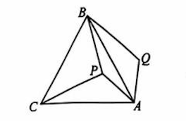
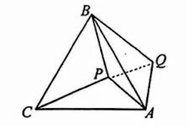

# 几何作图指令集

本文档包含16组几何作图指令，每组包含：
- 一个几何作图指令
- 输入图片（作图前状态）
- 输出图片（作图后状态）

---

## 指令 01：连接 AC

**指令描述：** 连接 AC.

**输入图片：**

**输出图片：**

---

## 指令 02：作垂线

**指令描述：** 过点 A 作 AG 垂直BC 于点 G.

**输入图片：**

**输出图片：**

---

## 指令 03：作垂线

**指令描述：** 作 BF 垂直 OA 于点 F.

**输入图片：**

**输出图片：**

---

## 指令 04：作垂线

**指令描述：** 过点 F 作 FG 垂直 AB 于点 G.

**输入图片：**

**输出图片：**

---

## 指令 05：连接线段

**指令描述：** 连接 BD.

**输入图片：**

**输出图片：**

---

## 指令 06：连接线段

**指令描述：** 连接 PQ.

**输入图片：**

**输出图片：**

---

## 指令 07：连接线段

**指令描述：** 连接 BD.

**输入图片：**

**输出图片：**

---

## 指令 08：连接线段

**指令描述：** 连接 DH.

**输入图片：**

**输出图片：**

---

## 指令 09：连接线段

**指令描述：** 连接 DE.

**输入图片：**

**输出图片：**

---

## 指令 10：连接线段

**指令描述：** 连接 DE.

**输入图片：**

**输出图片：**

---

## 指令 11：作垂线

**指令描述：** 过点 E 作 EM 垂直 BF 于点 M.

**输入图片：**

**输出图片：**

---

## 指令 12：连接线段

**指令描述：** 连接 OC.

**输入图片：**

**输出图片：**

---

## 指令 13：连接多条线段

**指令描述：** 连接 ME,MD.

**输入图片：**

**输出图片：**

---

## 指令 14：连接线段

**指令描述：** 连接 BD.

**输入图片：**

**输出图片：**

---

## 指令 15：取中点并连接

**指令描述：** 取 BE 的中点 O,连接 AO.

**输入图片：**

**输出图片：**

---

## 指令 16：延长线段

**指令描述：** 延长 AE,BC交于点 F.

**输入图片：**

**输出图片：**

---

## 统计信息

- **总指令数：** 16条
- **图片总数：** 32张（16组输入输出对）
- **主要操作类型：**
  - 连接线段：9条指令
  - 作垂线：4条指令
  - 取中点：1条指令
  - 延长线段：1条指令
  - 多重操作：1条指令